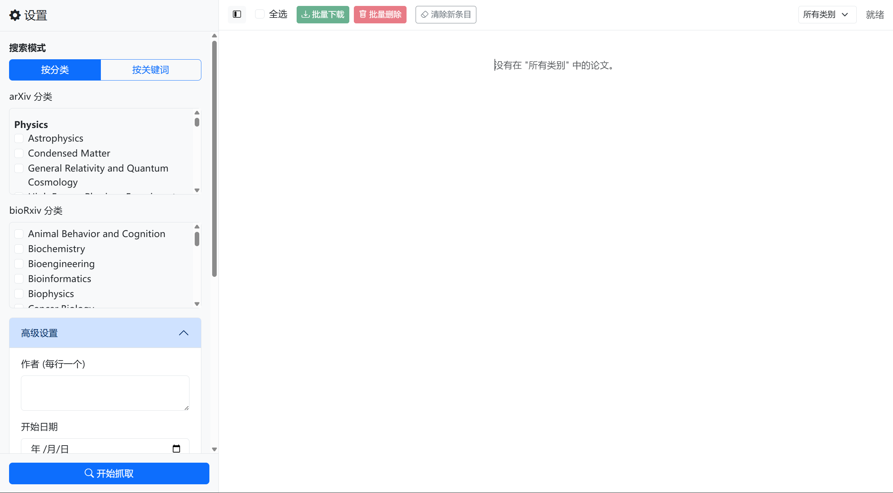

# Paper Fetching and Management Platform

This is a refactored and enhanced tool for fetching scientific papers. It provides a brand-new, Google-style three-pane Web UI and a feature-rich command-line interface (CLI). The new workflow allows users to first fetch and preview metadata (including abstracts) for a large number of papers, and then selectively download the ones they are interested in.



## ✨ Key Features

- **All-New Three-Pane Web UI**:
    - **Left Settings Panel**: A collapsible panel to centrally manage all fetching parameters, including switching between category/keyword modes, author search, sorting options, and other advanced settings.
    - **Center Paper List**: Displays the fetched papers, supporting multi-select, batch downloads, and real-time status updates.
    - **Right Details Panel**: Slides out on paper click, showing the full title, authors, abstract, and action buttons.
- **Preview Before Download**: The new workflow first retrieves a list of paper metadata. Users can read the abstracts before deciding which PDFs to download.
- **Powerful Search Capabilities**:
    - Supports precise searching by **keywords**, **categories**, **authors**, and even a list of **arXiv IDs**.
    - Allows customization of **sorting criteria** for arXiv results (e.g., by submission date, relevance).
- **Batch Processing**: Easily **select all** or multiple papers in the main panel for **batch downloading**.
- **Real-time Progress Updates**: Get real-time feedback on fetching status via WebSockets (Socket.IO). During downloads, each paper has its own independent progress bar.
- **Local File Interaction**: After a download is complete, you can directly use system commands from the UI to **open the PDF file** or its **containing folder**.
- **Robust Downloading**: Built-in `cloudscraper` to bypass Cloudflare's bot detection, ensuring successful downloads from protected sources like bioRxiv.
- **Persistent Storage**: Uses an SQLite database to log all downloaded papers, preventing duplicate downloads and simplifying management.
- **Rich Command-Line Interface (CLI)**: Retains full CLI functionality, including interactive and direct execution modes, making it suitable for automated scripts.

## 🚀 Quick Start

### 1. Prerequisites
- [Python 3.8+](https://www.python.org/)
- (Optional) [Docker](https://www.docker.com/)

### 2. Install Dependencies
After cloning the project, run the following command in the root directory:
```bash
pip install -r requirements.txt
```
> **Note**: `requirements.txt` includes `cloudscraper`, a library used to bypass Cloudflare protection, ensuring that downloads from sites like bioRxiv are successful.

### 3. Choose How to Run

#### Option A: Web UI (Recommended)
This is the most common way to run the project.
```bash
python app.py
```
After the server starts, open your browser and navigate to [http://127.0.0.1:8080](http://127.0.0.1:8080) to begin.

**New UI Workflow**:
1. In the left settings panel, choose between "By Category" or "By Keyword" mode.
2. Expand "Advanced Settings" to configure authors, sorting criteria, etc.
3. Click the "Start Fetching" button.
4. Once fetching is complete, the paper list will appear in the center panel.
5. Click on any paper to view its full details (including the abstract) in the right-hand panel.
6. You can check multiple papers for a "Batch Download" or download a single paper from the details panel.
7. After a download is complete, the "Open File" and "Open Folder" buttons will become available.

#### Option B: Command-Line Interface (CLI)
For automation scripts or users who prefer the terminal, the CLI offers powerful functionality.
```bash
# Start an interactive session
python -m src.main

# Directly fetch and download by keyword
python -m src.main --mode keyword
```

---

## ⚙️ Configuration (`config.yaml`)

You can modify most common settings directly in the Web UI, and they will be saved automatically to `config.yaml`.

### `fetch_settings`
Core parameters that control fetching behavior.

| Key | Type | Description |
| :--- | :--- | :--- |
| `method` | string | Default fetch mode: `category` or `keyword` |
| `category_fetch_days_ago` | int | **Category Mode**: Fetch papers from the last N days (for bioRxiv). |
| `max_papers_per_category_fetch` | int | **Category Mode**: Max number of papers to fetch per arXiv category. |
| `biorxiv_days_ago` | int | **Keyword Mode**: Fetch papers from the last N days (for bioRxiv). |
| `arxiv_max_results_kw` | int | **Keyword Mode**: Max number of papers to fetch from arXiv. |
| `arxiv_sort_by` | string | **New**: Sort criteria for arXiv. Options: `SubmittedDate`, `Relevance`, `LastUpdatedDate`. |
| `search_by_authors` | list | **New**: A list of authors to filter by in both arXiv and bioRxiv. |
| `search_by_ids` | list | **New**: A list of arXiv IDs for precise lookups. If not empty, all other filters are ignored. |

### `keywords`
A list of strings, effective only in **Keyword Mode**.

### `categories`
A dictionary defining the specific categories to fetch in **Category Mode**.

---

## 📁 Project Structure
```
.
├── app.py              # Web server entry point (Flask + SocketIO)
├── config.yaml         # Configuration file
├── requirements.txt    # Python dependencies
├── Dockerfile          # Docker configuration file
├── ui.png              # Web UI screenshot
├── paper/              # Default download directory for papers (.gitignore'd)
├── paper_crawler.db    # SQLite database file
├── templates/          # HTML template files
│   └── index.html
└── src/
    ├── __init__.py
    ├── main.py         # Command-line (CLI) entry point
    ├── config.py       # Config loading/saving module
    ├── utils.py        # Utility functions (networking, logging, etc.)
    ├── database.py     # Database interaction module
    ├── crawler.py      # Core crawling service
    └── fetchers.py     # Data fetching implementations (arXiv, bioRxiv)
```

## 📄 License
This project is licensed under the MIT License. See the `LICENSE` file for details.
