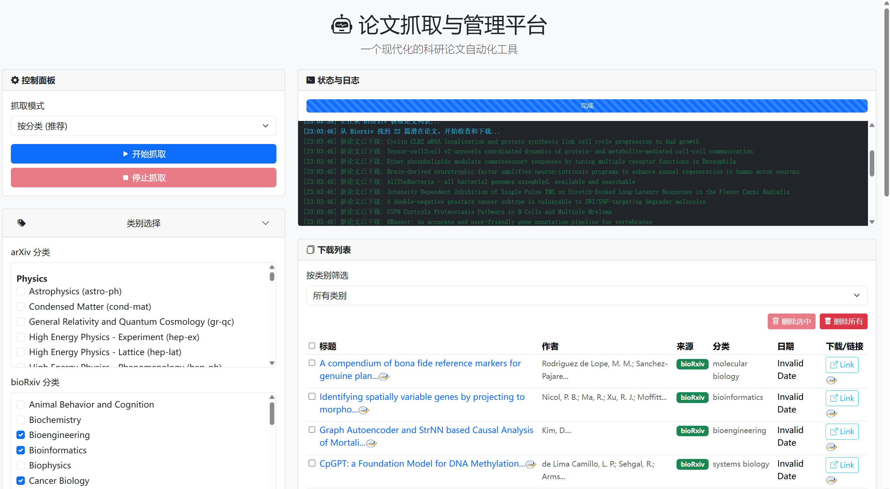

# 论文抓取与管理平台

这是一个经过重构和功能增强的科研论文抓取工具。它提供了一个现代化的 Web UI 和一个功能丰富的命令行界面 (CLI)，允许用户方便地配置抓取参数、实时监控抓取过程，并直接浏览、打开和管理下载的论文。



## ✨ 主要特性

- **现代化 Web UI**: 使用 Bootstrap 5 构建的响应式、单页应用界面。
- **丰富的命令行界面 (CLI)**:
    - **交互模式**: 通过 `python -m src.main` 启动一个引导式会话，无需记住命令参数。
    - **直接执行**: 使用 `--mode` 参数 (如 `category` 或 `keyword`) 进行快速、自动化的脚本调用。
    - **美化输出**: 使用 `rich` 库提供色彩丰富、清晰易读的日志和进度条。
- **实时进度更新**: 通过 WebSocket (Socket.IO) 实时显示抓取状态、日志和进度条。
- **在线配置**: 直接在网页上修改关键词、分类等参数并一键保存。
- **持久化存储**: 使用 SQLite 数据库记录所有下载的论文，避免重复下载，方便管理。
- **论文删除功能**: 支持单篇和批量删除已下载论文，同时删除本地存储的 PDF 文件。
- **后台任务**: 抓取任务在后台运行，不会阻塞 UI。
- **容器化支持**: 提供 `Dockerfile`，可一键打包部署。

## 🚀 快速开始

### 1. 环境准备
- [Python 3.8+](https://www.python.org/)
- (可选) [Docker](https://www.docker.com/)

### 2. 安装依赖
克隆项目后，在项目根目录运行：
```bash
pip install -r requirements.txt
```

### 3. 选择运行方式

#### 方式 A: Web UI (推荐)
这是运行此项目的最常用方式。
```bash
python app.py
```
服务器启动后，打开你的浏览器并访问 [http://127.0.0.1:8080](http://127.0.0.1:8080) 即可开始使用。

#### 方式 B: 命令行界面 (CLI)
对于自动化脚本或喜欢终端的用户，CLI 提供了强大的功能。

**交互模式 (推荐入门)**:
如果你不确定要使用哪些参数，或者只是想快速开始，请运行：
```bash
python -m src.main
```
程序将引导你完成模式选择等步骤。

**直接执行模式**:
对于自动化脚本，可以直接指定抓取模式：
```bash
# 按分类抓取
python -m src.main --mode category

# 按关键词抓取
python -m src.main --mode keyword
```

---

## ⚙️ 配置说明 (`config.yaml`)

你可以在 Web UI 中直接修改大部分常用配置。对于更高级的设置，可以直接编辑项目根目录下的 `config.yaml` 文件。

### `fetch_settings`
控制抓取行为的核心参数。

| 键 | 类型 | 描述 | 默认值 |
| :--- | :--- | :--- | :--- |
| `method` | string | 默认抓取模式: `category` 或 `keyword` | `category` |
| `category_fetch_days_ago` | int | **分类模式**: 获取过去 N 天的论文。 | `2` |
| `max_papers_per_category_fetch` | int | **分类模式**: 每个分类（如 `cs.CV`）最多获取的论文数。 | `10` |
| `ensure_diversity_in_category_fetch`| bool | **分类模式**: 是否确保每个子分类都抓取到论文 (暂未实现)。 | `true` |
| `min_papers_per_sub_category` | int | **分类模式**: 每个子分类最少抓取数 (暂未实现)。 | `1` |
| `max_papers_per_sub_category` | int | **分类模式**: 每个子分类最多抓取数 (暂未实现)。 | `3` |
| `biorxiv_days_ago` | int | **关键词模式**: 从 bioRxiv 获取过去 N 天的论文。 | `3` |
| `arxiv_max_results_kw` | int | **关键词模式**: 从 arXiv 获取的最大论文数量。 | `100` |

### `output_settings`
控制输出的设置。

| 键 | 类型 | 描述 | 默认值 |
| :--- | :--- | :--- | :--- |
| `biorxiv_include_abstract_in_md` | bool | (暂未实现) 是否在生成的 Markdown 文件中包含摘要。 | `true` |

### `keywords`
一个字符串列表，仅在 **关键词模式** 下生效。
```yaml
keywords:
  - "systems biology"
  - "synthetic biology"
  - "medical ai"
```

### `categories`
一个字典，定义了在 **分类模式** 下要抓取的具体类别。
```yaml
categories:
  arxiv:
    - 'cs.CV'
    - 'q-bio.GN'
  biorxiv:
    - 'bioengineering'
    - 'bioinformatics'
```

---

## 📁 项目结构
```
.
├── app.py              # Web 服务器入口 (Flask + SocketIO)
├── config.yaml         # 配置文件
├── requirements.txt    # Python 依赖
├── Dockerfile          # Docker 配置文件
├── ui.png              # Web UI 截图
├── paper/              # 论文下载目录 (默认 .gitignore)
├── paper_crawler.db    # SQLite 数据库文件
├── templates/          # HTML 模板文件
│   └── index.html
└── src/
    ├── __init__.py
    ├── main.py         # 命令行 (CLI) 入口
    ├── config.py       # 配置加载/保存模块
    ├── utils.py        # 辅助函数 (网络请求, 日志等)
    ├── database.py     # 数据库交互模块
    ├── crawler.py      # 核心抓取服务
    └── fetchers.py     # 各来源 (arXiv, bioRxiv) 的数据获取实现
```

## 📄 许可证
本项目采用 MIT 许可证。详情请见 `LICENSE` 文件。
